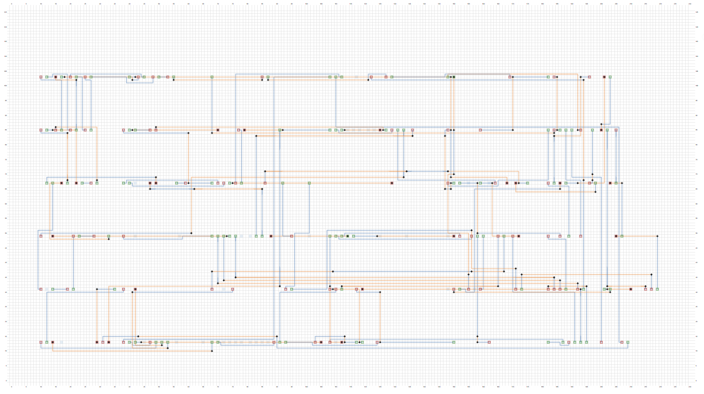

# VLSI CAD Maze Router

This project implements a **Maze Router** for large-scale ASIC physical design, supporting dual-layer routing, non-uniform grid costs, bend penalties, and via penalties. It features both **Dijkstra** and **A*** search algorithms, along with a performance benchmarking mechanism.

---

##  Project Directory Structure

* `include/` : Header files (`types.h`, `io.h`, `router.h`)
* `src/` : Source implementation files (`main.cpp`, `io.cpp`, `router.cpp`)
* `data/` : Input benchmark test cases (**Note: Test files are proprietary and not included in this repository**)
* `build/` : Compiled binaries and routing result outputs
* `makefile` : Automation build and run script

---

##  Input File Formats

The program reads two plain-text format input files:

1. **Grid File (`.grid`)**
   * **First Line**: Defines columns (X), rows (Y), bend penalty, and via penalty.
   * **Matrix Body**: Grid costs for Layer 1 and Layer 2, where `1` represents available space, `-1` represents obstacles, and positive integers greater than `1` represent high-cost routing regions.

2. **Netlist File (`.nl`)**
   * **First Line**: Total number of routing nets.
   * **Subsequent Lines**: Each line specifies a single net: `Net ID`, `Start Layer`, `Start X`, `Start Y`, `End Layer`, `End X`, `End Y`.

---

##  How to Build and Run

This project uses a standard `Make` build automation script optimized with `-O3` performance flags.

### 1. Compile the Project
Open a terminal in the root directory and run:
```bash
make
```
### 2. Run Specific Benchmarks
You can execute and test individual benchmarks using the general make rule:
```Bash
make 
run TEST=bench1
```
This automatically reads data from data/bench1.grid and data/bench1.nl, and outputs _Dijkstra.rout and _A_star.rout results into the build/ directory.
### 3. Clean Build Artifacts
To clear compiled binaries and previous outputs:

```Bash
make clean
```
## Visualization Tool
To graphically inspect and verify the routing paths, you can use the official web-based visualization tool (Note: This online visualizer is an external public utility, not owned or hosted by this project):

Online Router Visualizer: https://spark-public.s3.amazonaws.com/vlsicad/javascript_tools/router.html



Usage: Drag and drop your .grid benchmark file and the corresponding .rout result file into the respective browser drop zones to render the multi-layer routing layout.